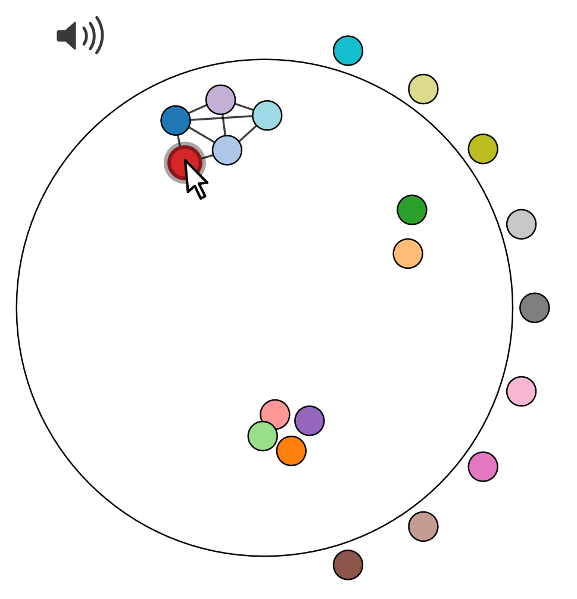

#

This is a Javascript toolbox to perform online rating studies with auditory material. The main feature of the toolbox is that audio samples are associated with visual tokens on the screen that control audio playback and can be manipulated depending on the type of rating. This allows the collection of single- and multi-dimensional feature ratings, as well as categorical and similarity ratings. The toolbox can be used via a plugin for the widely-used [jsPsych](https://www.jspsych.org), as well as using plain Javascript for custom applications.

## Citation

Donhauser, Peter, and Denise Klein. 2021. “Audio-tokens: A Toolbox for Rating, Sorting and Comparing Audio Samples in the Browser.” PsyArXiv. October 16. doi: [10.31234/osf.io/3j58q](https://doi.org/10.31234/osf.io/3j58q)

## Contents

- [Screenshots](#screenshots)
- [Usage](#usage)
- [Results](#results)

## Screenshots

### Sorting

#### Adaptations
This repo only contains the clustering capabilities of `audio_tokens`.
Colors were unified to a single color, and edges will stay for the members of the cluster of the last moved circle.
